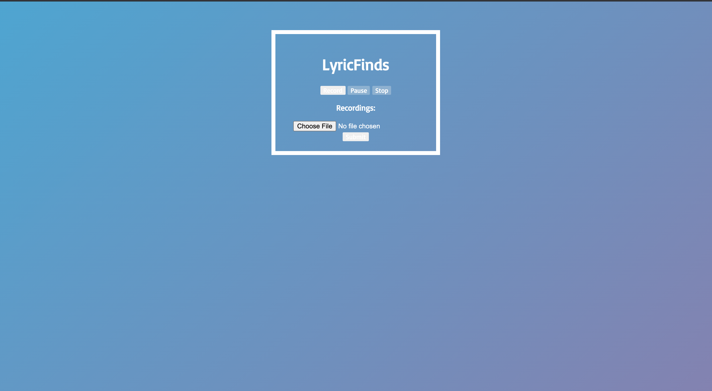
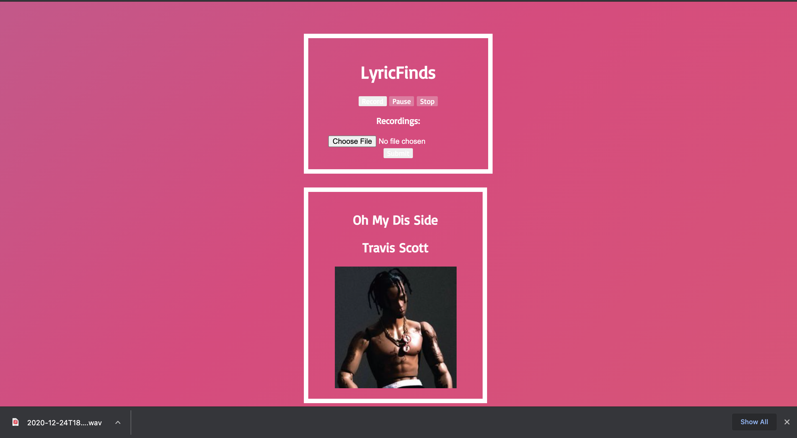

# LyricsFinds
---

## What it is?

LyricsFinds is a website that recognizes songs based on user's audio to text input. For exmaple, users may know certain lyrics yet, do not know the artist or the song name itself. After rendering the audio(which is the lyrics that the user sang) it will ouput the artist name, song name, and the album image/cover art to the users.

---

## How I Built it?

I built the website backend through Flask and Python. To build the recorder extension from I used JS for users to capture audio. This renders through the Flask backend script as a WAV audio file. I used Google's speech recognition module to convert the WAV file to strings. After understanding and polishing the user's input, I used web scrapping tools such as BS4(Beautiful Soup) to get back information about the lyrics. THe BS4 function renders back information of the lyrics that seraches throughout the internet. For the album image, it returns back the image address of the song/album based on accurate sources on the internet. This passed through the app.py into the template to render a  tag with the src as the image address. 

# Softwares and Tools Used: 
- Flask 
- Python 
- JS, HTML, CSS 
- BS4(Beautiful Soup)
- HTMLSession
- Google Speech Recognition

---

## How Can I Improve?

1. Improve a better method to pass in WAV audio instead of manually downloading the WAV audio. I can stream the audio through JS instead. 
3. Add more CSS styling and transistions when outputting the results
4. Add user authentication using Firebase

---

## Installation

1. Install dependencies with the [requirements.txt](requirements.txt)
2. Fork of clone the github repo to your local computer 
3. Edit [app.py](src/app.py)
  1. Change `app.config["AUDIO_UPLOADS"] = "/Users/pranav/Downloads/"` by setting the app.config to your designted path or folder.
  2. Change `with sr.AudioFile(f"/Users/pranav/Downloads/{wav_audio_name}") as source:` by removing `/Users/pranav/Downloads/` and setting it to the app.config path or folder.
  3. After these changes you can run the Flask app by going into the src folder and running `python3 app.py`

---

## UI Screenshot

---

## UI Results Screenshot

